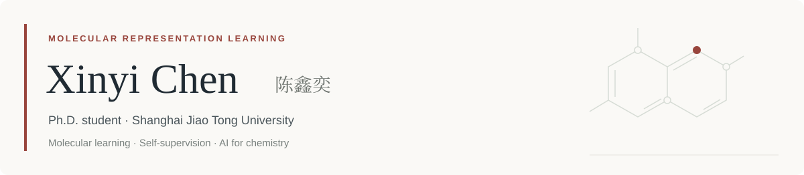

<picture>
  <source media="(prefers-color-scheme: dark)" srcset="./assets/profile-header-dark.svg">
  
</picture>

  <strong>English</strong> · <a href="./README.zh-CN.md">中文</a>
  &nbsp; / &nbsp;
  <a href="https://cxy0206.github.io/">Homepage</a> · <a href="mailto:chenxinyi@sjtu.edu.cn">Email</a>

I am a direct-entry Ph.D. student in **Mechanical Engineering** at **Global College, Shanghai Jiao Tong University**, advised by **Wendong Wang** and **Paul Weng**. My research interests include molecular representation learning, self-supervised learning, and AI for chemistry.

## Publication

**PRISM: Prior Relational Information for Self-supervised Modeling to Enhance Solubility OOD Generalization**  
**Xinyi Chen**, Jiahuan Pang, Titus Chima, Wendong Wang, Paul Weng  
*Advances in Neural Information Processing Systems (NeurIPS), 2026* — **Accepted**

## Education

- **Shanghai Jiao Tong University** · Sep 2024 – Expected 2029  
  Direct-entry Ph.D. student in Mechanical Engineering · Global College
- **Shanghai Jiao Tong University** · Sep 2020 – Aug 2024  
  Bachelor's degree in Electrical and Computer Engineering · UM–SJTU Joint Institute

## Technical background

**Python · PyTorch · RDKit · Git · Linux**

Experience with molecular graph learning, self-supervised learning, and out-of-distribution evaluation; Linux-based model training and research GPU server setup. Both my undergraduate and doctoral programs are taught in English.

<strong>Teaching & honors</strong>

**Teaching Assistant · Shanghai Jiao Tong University**

- Applications of Machine Learning in Molecular and Materials Science — Spring 2025
- Data Structures and Algorithms — Fall 2022

**First-Class Freshman Scholarship · Shanghai Jiao Tong University · 2020**  
Full-tuition entrance scholarship; awarded to 2 of approximately 300 students in the cohort.

---

Shanghai, China · [chenxinyi@sjtu.edu.cn](mailto:chenxinyi@sjtu.edu.cn)
